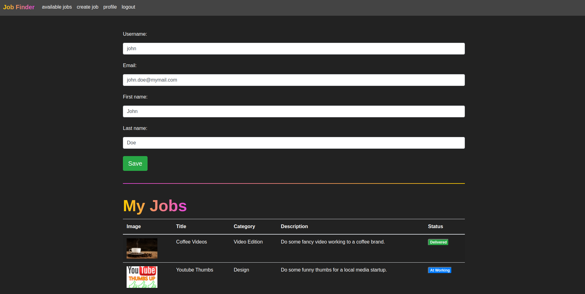

# Job Finder 📚

A complete book sharing system for kids.

## Main idea

#### This project is a lightweight freelancing management system which allows registered users to find and assign jobs in a secure environment.

## Technologies Used:
- Python
- Django
- SQlite3
- Bootstrap
- JavaScript
    
## Highlights:

#### Easy find and apply for a job.

#### Bootstrap modals gives a fluid navigation and enhace the engagement.

Search bar is easy to use and provide a wide search to quickly find books, users or authors.

#### Profile area let the user manage his jobs easily.

#### Authentication system implements a strong password validation and a complete recovery password cycle.

## Installation

To get it running on a linux server, launch the commands bellow:

    git clone https://github.com/Gabriel-Nunes/job_finder.git
    cd job_finder/
    python3 -m venv venv
    source venv/bin/activate
    pip install --upgrade pip
    pip install requirements.txt
    python manage.py runserver 

Your jobs management system is suposed to be running on 127.0.0.1:8000.

>>>>>>> #### Have fun! 🤓
