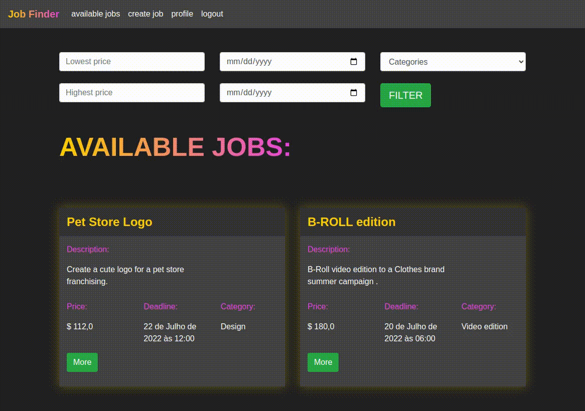

# Job Finder 🤓

A job management system.

## Main idea

#### This project is a lightweight freelancing management system which allows registered users to find and assign jobs in a secure environment.

## Technologies Used:
- Python
- Django
- Docker & Docker-Compose
- SQlite3
- Bootstrap
- JavaScript
    
## Highlights:

#### Easy find and apply for a job.

#### Bootstrap modals gives a fluid navigation and enhace the engagement.

Search bar is easy to use and provide a wide search to quickly find books, users or authors.

#### Profile area let the user manage his jobs easily.

#### Authentication system implements a strong password validation and a complete recovery password cycle.

## Installation

To get it running on a linux server, launch the commands bellow:

    sudo chmod +x install.sh
    git clone https://github.com/Gabriel-Nunes/job_finder.git
    cd /job_finder
    ./install.sh
 
Now your jobs management system is suposed to be running on 127.0.0.1:8000.

Before using, you have to create a superuser. So open other terminal and run:
    
    docker-compose exec web_run bash
    python manage.py create superuser

#### Set your super user data.
Now whenever you want to launch the system you can just the following command on project directory:
 
    docker-compose up

#### You may also want to take a look at Django "admin" page at "0.0.0.0:8000".

>>>>>>> #### Have fun! ✅

**Note: this is a demonstration project. If you intend to use it in production take a look at "https://docs.djangoproject.com/en/4.0/howto/deployment/"**
